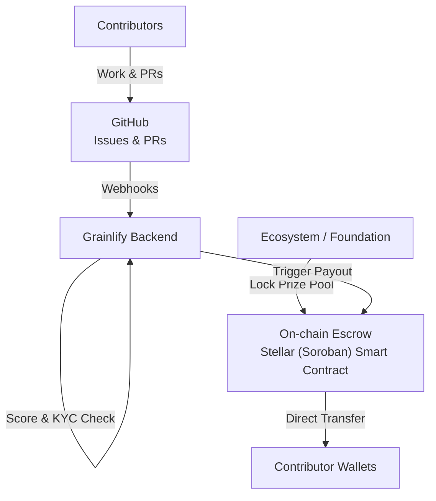
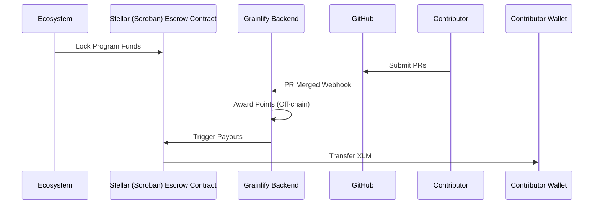

# 📘 Grainlify — Grant Execution Infrastructure for Open Source

## 1. Problem Statement

Open-source ecosystems regularly allocate **grant funding** to support critical projects and contributors.

However, today’s grant execution model has major gaps:

- Grant money is often managed **off-chain**
- Project maintainers manually distribute rewards
- Contributor payments are delayed or subjective
- Ecosystems lack verifiable proof of how grants convert into real work
- Contributors must trust platforms or maintainers to be paid fairly

Platforms like OnlyDust solve **grant discovery and coordination**, but **grant execution and payout automation remain largely manual**.

---

## 2. Our Core Idea (One Sentence)

> **Grainlify is a grant execution layer that converts ecosystem funding into automated, verifiable payments for open-source contributions.**

---

## 3. High-Level Concept

Grainlify sits **between ecosystems and contributors**, ensuring that:

1. Ecosystems fund **programs** (hackathons, grant rounds)
2. Programs fund **projects**
3. Projects fund **contributors**
4. All payouts are:
   - escrow-backed
   - rule-based
   - automated on real GitHub work
   - verifiable on-chain

---

## 4. Two Core Execution Modes

Grainlify supports both **time-boxed programs** and **continuous contributions**.

This enables **continuous OSS funding**, not just events.

---

## 5. System Roles

### Ecosystem (Stellar)

- Provide grant capital
- Define program scope and duration
- Gain transparent, verifiable impact data

### Grainlify Platform

- Operates grant programs and hackathons
- Tracks contributions and scoring
- Enforces execution rules
- Automates payouts
- Handles compliance off-chain

### Project Maintainers

- Register projects
- Create issues and bounties
- Define point values
- Lock funds into escrow

### Contributors

- Work normally on GitHub
- Submit PRs
- Earn points or rewards
- Get paid automatically after verification

---

## 6. What Lives Where (Very Important)

### Off-Chain (Backend)

Stored and processed off-chain:

- projects and repositories
- GitHub issues and PRs (via webhooks / API)
- point assignments and scoring
- contributor rankings
- KYC status
- payout calculation

This keeps the system:

- flexible
- efficient
- privacy-safe

### On-Chain (Smart Contracts)

Stored on-chain **only**:

- program or hackathon escrow
- total funds locked
- remaining balance
- authorized payout key
- final payouts to wallets

No identities, points, or GitHub data are stored on-chain.

---

## 7. End-to-End Flow (Hackathon Example)

### Step 1 — Program Funding

- Ecosystem locks funds into an on-chain escrow  
  Example: 50,000 XLM for “Stellar Q1 OSS Program”

### Step 2 — Hackathon Runs

- Projects participate
- Contributors work on GitHub
- Points are awarded off-chain

### Step 3 — Scoring & Eligibility

- Backend computes final scores
- Only **KYC-approved contributors** are eligible for payout

### Step 4 — Automated Payout

- Backend triggers escrow contract
- Funds are sent **directly** to contributor wallets
- Backend never holds funds

### Hackathon Flow (Diagram)



### Detailed Sequence Flow



---

## 8. KYC & Compliance Model

KYC is handled entirely off-chain.

- Contributor identity and status are never stored on-chain
- Only wallets linked to approved KYC records are included in payouts

This ensures:

- privacy
- regulatory flexibility
- minimal on-chain complexity

---

## 9. Why This Model Works

### For Ecosystems

- Funds locked before work begins
- Clear proof of grant usage
- Reduced misuse risk

### For Maintainers

- No manual reward handling
- Budget clarity
- Lower admin overhead

### For Contributors

- Predictable rewards
- Guaranteed payouts
- Merit-based scoring

---

## 10. Key Differentiation

| Feature | Traditional Grant Platforms | Grainlify |
|---|---:|---:|
| Grant discovery | ✅ | ✅ |
| Hackathons | ✅ | ✅ |
| Always-on bounties | ❌ | ✅ |
| On-chain escrow | ❌ | ✅ |
| Point-based allocation | ❌ | ✅ |
| Automated payouts | ❌ | ✅ |
| Non-custodial payments | ❌ | ✅ |

---

## 11. Design Principles

- **Escrow-first**: funds locked before work begins
- **Automation over trust**: payouts follow rules
- **Minimal on-chain logic**: contracts act as vaults
- **Off-chain intelligence**: scoring and verification stay flexible
- **Ecosystem-agnostic**: same execution model across chains

---

## 12. What Grainlify Is (and Is Not)

### Grainlify Is

- a grant execution infrastructure
- a payout automation layer
- a coordination system for OSS funding

### Grainlify Is Not

- a DAO
- a marketplace
- a GitHub replacement
- a custodial payment platform

---

## 13. Vision

Grainlify’s long-term vision is to become the default execution layer for open-source grants, enabling ecosystems to move from:

> “We funded projects.”

to:

> “We verifiably paid for real work.”

---

## 14. Smart Contract Documentation

### 📋 Contract Manifests

This repository includes machine-readable metadata manifests for all major smart contracts. These manifests provide comprehensive documentation in a structured format that can be used by developers, tools, and documentation systems.

#### Available Manifests

| Contract | Manifest | Description |
|---|---|---|
| **BountyEscrowContract** | [`bounty-escrow-manifest.json`](contracts/bounty-escrow-manifest.json) | Manages bounty escrow with multi-token support, capability-based authorization, and comprehensive security features |
| **GrainlifyContract** | [`grainlify-core-manifest.json`](contracts/grainlify-core-manifest.json) | Provides secure contract upgrade mechanism with version tracking, migration support, and multisig governance |
| **ProgramEscrowContract** | [`program-escrow-manifest.json`](contracts/program-escrow-manifest.json) | Handles hackathon and program prize pools with batch payouts, dependency management, and circuit breaker protection |

#### Manifest Schema

All manifests follow the [Contract Manifest Schema](contracts/contract-manifest-schema.json), which defines:

- **Contract metadata** (name, purpose, version)
- **Entrypoints** (public, view, admin functions with parameters and authorization)
- **Configuration** (parameters, storage keys, defaults)
- **Behaviors** (security features, access control, critical behaviors, error handling)
- **Dependencies** (contracts, tokens, external APIs)
- **Deployment information** (initialization, upgrade process)
- **Testing coverage** and documentation references

#### Using the Manifests

##### For Developers

```bash
# Validate manifests locally
npm install -g ajv-cli
./scripts/validate-manifests.sh

# View contract information
jq '.contract_name, .version.current' contracts/bounty-escrow-manifest.json

# List all entrypoints
jq '.entrypoints.public[].name' contracts/grainlify-core-manifest.json
```

##### For Tool Integration

The manifests can be used to automatically generate:

- API documentation
- Client SDKs
- Type definitions
- Deployment scripts
- Test suites

Example: Extract all public functions with their parameters:

```javascript
const manifest = require('./bounty-escrow-manifest.json');
const publicFunctions = manifest.entrypoints.public.map(fn => ({
  name: fn.name,
  description: fn.description,
  parameters: fn.parameters,
  authorization: fn.authorization
}));
```

#### Validation

Manifests are automatically validated in CI/CD to ensure:

- Schema compliance
- Required fields presence
- Valid authorization values
- Proper version formatting
- Structural integrity

You can also validate locally:

```bash
# Using the provided script
./scripts/validate-manifests.sh

# Or manually with ajv
ajv validate -s contracts/contract-manifest-schema.json -d contracts/bounty-escrow-manifest.json
```

#### Contributing

When adding new contracts or updating existing ones:

1. Update the corresponding manifest file
2. Ensure all required fields are present
3. Validate against the schema
4. Update version numbers if needed
5. Test the validation script

The manifests are versioned alongside the contracts and should be updated whenever contract interfaces change.

---

## 15. One-Line Summary

> **Grainlify turns ecosystem grants into automatic, verifiable payments for open-source contributions.**
